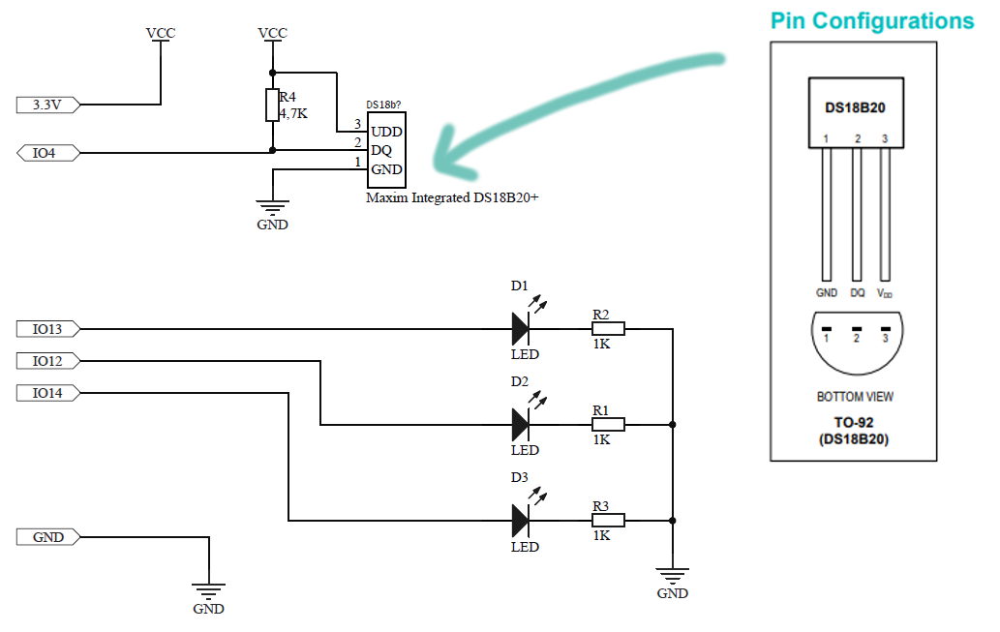

---
author: Vojtěch Mrázek
title: "TOI: 1. cvičení"
date: Březen 2021
...

# Cíle cvičení
Tato cvičení slouží k základnímu seznámení s platformou ESP32 v prostředí IDF. Toto prostředí bylo zvoleno, jelikož se (narozdíl od Arduina) jedná o rozhraní, které je určeno pro produkční prostředí. Se zabalením do Arduina sice získáte řádově jednodušší kód (ukázka [zde](https://github.com/mrazekv/seminariot/blob/master/demo_05_receive/demo_05_receive.ino)), ale jste naprosto závislí na ostatních vývojářích a na jejich pojetí funkcionality. Pokud byste chtěli v tomto prostředí napsat aplikaci, která bude odolná, nebudete spokojeni.

# Programování a první přípravek
Vaším prvním úkolem, který jste dostali předem, bylo rozchodit výpis na sériovou linku s využitím funkce `printf`. K tomu se využívá prostředí __Platformio__. 

```c
#include <stdio.h>

void app_main() {
    printf("Hello world\n");
    while(1) {}
}
``` 

Připomínám, že pro správný výstup je třeba zadat rychlost sériového monitoru do konfiguračního souboru `platformio.ini`.
```ini
[env:esp32dev]
platform = espressif32
board = esp32dev
framework = espidf
monitor_speed = 115200
monitor_flags = --raw  # pro barvy v terminalu
```

Častým problémem je to, že se nepodaří připojit při programováník desce. To je možné řešit pomocí stisku tlačítka (BOOT) na desce při připojování na dobu cca 4 vteřin.

# Zapojení periferií
Zapojte na bread-boardu periferie (3x LED dioda a čidlo DS18B20) podle následujícího schématu. Zapojování doporučuji provádět při odpojeném USB. Věnujte pozornost zapojení pouzdra _TO-92_ teplotního čidla. V případě nejasností či problému se fungováním breadbordů se ptejte cvičícího.



Pokud čidlo začne hřát, zapojili jste jej špatně!


Pokud jsou popisky nečitelné, můžete se podívat na toto schéma. _Pozor, piny 34, 35, 36 a 39 mohou být pouze vstupy_.


# První aplikace - blikání LED diodami
[comment]: https://exploreembedded.com/wiki/Hello_World_with_ESP32_Explained
Cílem tohoto podúkolu je rozblikat připojené LED diody a jednu vnitřní. Pro 

Na začátku je potřeba vložit správné knihovny potřebné k práci se systémem FreeRTOS a s rozhraním ESP32.

```c
#include <stdio.h>
#include "freertos/FreeRTOS.h"
#include "freertos/task.h"
#include "esp_system.h"
#include "nvs_flash.h" 
```

Výchozím bodem celé aplikace je funkce `app_main`. V ní zinicializujeme non-volatilní paměť FLASH a vytvoříme novou úlohu. Všiměte si, že funce `nvs_flash_init` má návratovou hodnotu typu `esp_err_t`, a proto ji kontrolujeme pomocí makra [`ESP_ERROR_CHECK`](https://docs.espressif.com/projects/esp-idf/en/latest/esp32/api-guides/error-handling.html#esp-error-check-macro).

```c
void app_main()
{
    ESP_ERROR_CHECK(nvs_flash_init());
    xTaskCreate(&hello_task, "hello_task", 2048, NULL, 5, NULL);
}
```

Při vytváření funkce jse pro nás důležitý parametr velikosti zásobníku. Tuto velikost volíme podle naší zkušenosti, nebo můžeme pomocí funkce [`uxTaskGetStackSizeHighWaterMark`](https://www.freertos.org/uxTaskGetStackHighWaterMark.html).

```c
BaseType_t xTaskCreate(     TaskFunction_t pvTaskCode,
                            const char * const pcName,
                            configSTACK_DEPTH_TYPE usStackDepth,
                            void *pvParameters,
                            UBaseType_t uxPriority,
                            TaskHandle_t *pxCreatedTask
                      );
```


## Nastavení GPIO
Jak si asi pamatujete z práce s jinými kity, musíme všechny periferie nakonfigurovat. Nyní budeme pracovat s GPIO, které jsou svázány s metodami a makry v knihovně
```c
#include "driver/gpio.h"
```
Pro práci nám pomohou tyto funkce pro daný pin `GPIOID`
```c
// zvolíme IO výstup do módu GPIO (tj. není to např UART)
gpio_pad_select_gpio(GPIOID);
// pin je výstupní
gpio_set_direction(GPIOID, GPIO_MODE_OUTPUT);
// nastavení výstupní hodnoty
gpio_set_level(GPIOID, VALUE);
```

## Úkol 1
Po složení jsme schopni dojít k následujícímu kódu, který si __zkuste spustit__. Všimněte si techniky čekání využívající systému FreeRTOS ` vTaskDelay(1000 / portTICK_RATE_MS);`


```c
#include <stdio.h>
#include "freertos/FreeRTOS.h"
#include "freertos/task.h"
#include "esp_system.h"
#include "nvs_flash.h"


#include "driver/gpio.h"


#define GPIO_LED_RED  2
#define GPIO_LED1     13
#define GPIO_LED2     12
#define GPIO_LED3     14


void hello_task(void *pvParameter)
{
    printf("Hello world!\n");
    for (int i = 1; 1 ; i++) {
        printf("Running %d seconds...\n", i);
        vTaskDelay(1000 / portTICK_RATE_MS);
    }
}

void blink_task(void *pvParameter) {
    gpio_pad_select_gpio(GPIO_LED_RED);
    gpio_pad_select_gpio(GPIO_LED1);
    gpio_pad_select_gpio(GPIO_LED2);
    gpio_pad_select_gpio(GPIO_LED3);


    /* Set the GPIO as a push/pull output */
    ESP_ERROR_CHECK(gpio_set_direction(GPIO_LED_RED, GPIO_MODE_OUTPUT));
    ESP_ERROR_CHECK(gpio_set_direction(GPIO_LED1, GPIO_MODE_OUTPUT));
    ESP_ERROR_CHECK(gpio_set_direction(GPIO_LED2, GPIO_MODE_OUTPUT));
    ESP_ERROR_CHECK(gpio_set_direction(GPIO_LED3, GPIO_MODE_OUTPUT));

    int cnt = 0;

    while(1) {
        /* Blink off (output low) */
        ESP_ERROR_CHECK(gpio_set_level(GPIO_LED_RED, cnt & 0x01));
        ESP_ERROR_CHECK(gpio_set_level(GPIO_LED1, cnt & 0x01));
        ESP_ERROR_CHECK(gpio_set_level(GPIO_LED2, cnt & 0x02));
        ESP_ERROR_CHECK(gpio_set_level(GPIO_LED3, cnt & 0x04));
        vTaskDelay(500 / portTICK_RATE_MS);
        cnt++;
    }
}
void app_main() {
    ESP_ERROR_CHECK(nvs_flash_init());
    xTaskCreate(&hello_task, "hello_task", 2048, NULL, 5, NULL);
    xTaskCreate(&blink_task, "blink_task", 512, NULL, 5, NULL);
}
```

# Čtení teploty
Pro čtení teploty z čidla DS18B20 je nejvýhodnější použít nějakou knihovnu. Tato knihovna je distribuovaná ve formě _komponenty_, kterou si musíte nainstalovat. Proto vytvořte v kořenovém adresáři porjektu složku `components` a vložte do ní dvě základní knihovny
```bash
mkdir components
cd components
git clone https://github.com/DavidAntliff/esp32-owb.git
git clone https://github.com/DavidAntliff/esp32-ds18b20.git
```
Alternativně můžete rozbalit do složky components tyto archivy: [esp32-owb.zip](https://github.com/DavidAntliff/esp32-owb/archive/master.zip) a [esp32-ds18b20](https://github.com/DavidAntliff/esp32-ds18b20/archive/master.zip).

všimněte si, jak vypadá CMakeFile.txt v komponentě, který v CMake systému přidává složku pro include, řeší pořadí kompilace a přidává zdrojový kód.
```cmake
set(COMPONENT_ADD_INCLUDEDIRS "include")
set(COMPONENT_SRCS "ds18b20.c")
set(COMPONENT_PRIV_REQUIRES "esp32-owb")
register_component()
```

Celkově tedy CMAKE čte všechny *.c soubory ve složce SRC a přidává definice ze složky components.


## Úkol 2
Nainstalujte komponenty a vytvořte ve složce `src` soubor `onewire.c`s následujícím obsahem. Dále pak v `app_main` vytvořte nový task (se stackem 2048). Po spuštění by se pak na konzoli měla periodicky vypisovat teplota.

```c
#include <stdio.h>
#include "freertos/FreeRTOS.h"
#include "freertos/task.h"
#include "esp_system.h"
#include "esp_log.h"

#include "driver/gpio.h"
#include "owb.h"
#include "owb_rmt.h"
#include "ds18b20.h"

#define GPIO_DS18B20_0       (4)
#define MAX_DEVICES          (8)
#define DS18B20_RESOLUTION   (DS18B20_RESOLUTION_12_BIT)
#define SAMPLE_PERIOD        (1000)   // milliseconds


void onewire_task(void *pvParameter)
{
    // Stable readings require a brief period before communication
    vTaskDelay(2000.0 / portTICK_PERIOD_MS);

    // Create a 1-Wire bus, using the RMT timeslot driver
    OneWireBus * owb;
    owb_rmt_driver_info rmt_driver_info;
    owb = owb_rmt_initialize(&rmt_driver_info, GPIO_DS18B20_0,
                             RMT_CHANNEL_1, RMT_CHANNEL_0);
    owb_use_crc(owb, true);  // enable CRC check for ROM code

    // Find all connected devices
    ESP_LOGI("one-wire", "Find devices:\n");
    OneWireBus_ROMCode device_rom_codes[MAX_DEVICES] = {0};
    int num_devices = 0;
    OneWireBus_SearchState search_state = {0};
    bool found = false;
    owb_search_first(owb, &search_state, &found);
    while (found)
    {
        char rom_code_s[17];
        owb_string_from_rom_code(search_state.rom_code, rom_code_s,
                                 sizeof(rom_code_s));
        printf("  %d : %s\n", num_devices, rom_code_s);
        device_rom_codes[num_devices] = search_state.rom_code;
        ++num_devices;
        owb_search_next(owb, &search_state, &found);
    }
    ESP_LOGI("one-wire", "Found %d device%s", num_devices, 
                         num_devices == 1 ? "" : "s");


    // Create DS18B20 devices on the 1-Wire bus
    DS18B20_Info * devices[MAX_DEVICES] = {0};
    for (int i = 0; i < num_devices; ++i)
    {
        DS18B20_Info * ds18b20_info = ds18b20_malloc();  
        // heap allocation
        devices[i] = ds18b20_info;

        if (num_devices == 1)
        {
            ESP_LOGI("one-wire", "Single device optimisations enabled");
            ds18b20_init_solo(ds18b20_info, owb);          
            // only one device on bus
        }
        else
        {
            ds18b20_init(ds18b20_info, owb, device_rom_codes[i]); 
            // associate with bus and device
        }
        ds18b20_use_crc(ds18b20_info, true);           
        // enable CRC check on all reads
        ds18b20_set_resolution(ds18b20_info, DS18B20_RESOLUTION);
    }

    // Read temperatures from all sensors sequentially
    while (1)
    {
        ESP_LOGI("one-wire", "Temperature readings (degrees C):");
        ds18b20_convert_all(owb);

        // In this application all devices use the same resolution,
        // so use the first device to determine the delay
        ds18b20_wait_for_conversion(devices[0]);
        
        for (int i = 0; i < num_devices; ++i)
        {
            float temp = 0;
            ds18b20_read_temp(devices[i], &temp);
            ESP_LOGI("one-wire", "  %d: %.3f\n", i, temp);

            /* @TODO: hodnotu z čidla temp uložte do nějaké sdílené 
            proměnné a navrhněte mechanismus komunikace mezi procesy, 
            který může být založen jen na sdílené proměnné */
        }
        vTaskDelay(1000 / portTICK_PERIOD_MS); 
        // @TODO: zvolte vhodnou periodu obnovy
    }
}
```

Pokud chcete tuto funkci volat v `main.c`, musíte samozřejmě její deklaraci nějak předat získat. Máte dvě možnosti. Buď vytvoříte hlavičkový soubor, který pomocí `#include` vložíte do `main.c`, nebo si (v tomto malém projektu) dovolíte jednu ne úplně přehlednou věc - vložíte deklaraci přímo do `main.c`:

```c
void onewire_task(void *pvParameter); // deklarace funkce z onewire.c
```


# WIFI
Dalším krokem je připojení k WIFI. V tomto případě vycházíme z [příkladu](https://github.com/espressif/esp-idf/blob/master/examples/wifi/getting_started/station/main/station_example_main.c), který řeší obnovu připojení po odpojení.

## Úkol 3
K tomu vytvořte v adresáři soubor `wifi.c` s následujícím kódem. Změňte své údaje k přístupu na WIFI. Tuto funkci zkuste zavolat přímo v `app_main`.

```c
#include <string.h>
#include "freertos/FreeRTOS.h"
#include "freertos/task.h"
#include "freertos/event_groups.h"
#include "esp_system.h"
#include "esp_wifi.h"
#include "esp_event.h"
#include "esp_log.h"
#include "nvs_flash.h"

#include "lwip/err.h"
#include "lwip/sys.h"

/* https://github.com/espressif/esp-idf/blob/master/examples/wifi/getting_started/station/main/station_example_main.c */


/* The examples use WiFi configuration that you can set via project 
   configuration menu
   If you'd rather not, just change the below entries to strings with
   the config you want - ie #define EXAMPLE_WIFI_SSID "mywifissid"
*/
#define EXAMPLE_ESP_WIFI_SSID      // @TODO SSID
#define EXAMPLE_ESP_WIFI_PASS      // @TODO HESLO
#define EXAMPLE_ESP_MAXIMUM_RETRY  10

/* FreeRTOS event group to signal when we are connected*/
static EventGroupHandle_t s_wifi_event_group;

/* The event group allows multiple bits for each event, but we only care about two events:
 * - we are connected to the AP with an IP
 * - we failed to connect after the maximum amount of retries */
#define WIFI_CONNECTED_BIT BIT0
#define WIFI_FAIL_BIT      BIT1

static const char *TAG = "wifi station";

static int s_retry_num = 0;

static void event_handler(void* arg, esp_event_base_t event_base,
                                int32_t event_id, void* event_data)
{
    if (event_base == WIFI_EVENT && event_id == WIFI_EVENT_STA_START) {
        esp_wifi_connect();
    } else if (event_base == WIFI_EVENT && event_id == WIFI_EVENT_STA_DISCONNECTED) {
        if (s_retry_num < EXAMPLE_ESP_MAXIMUM_RETRY) {
            esp_wifi_connect();
            s_retry_num++;
            ESP_LOGI(TAG, "retry to connect to the AP");
        } else {
            xEventGroupSetBits(s_wifi_event_group, WIFI_FAIL_BIT);
        }
        ESP_LOGI(TAG,"connect to the AP fail");
    } else if (event_base == IP_EVENT && event_id == IP_EVENT_STA_GOT_IP) {
        ip_event_got_ip_t* event = (ip_event_got_ip_t*) event_data;
        ESP_LOGI(TAG, "got ip:" IPSTR, IP2STR(&event->ip_info.ip));
        s_retry_num = 0;
        xEventGroupSetBits(s_wifi_event_group, WIFI_CONNECTED_BIT);
    }
}

void wifi_init_sta(void)
{
    s_wifi_event_group = xEventGroupCreate();

    ESP_ERROR_CHECK(esp_netif_init());

    ESP_ERROR_CHECK(esp_event_loop_create_default());
    esp_netif_create_default_wifi_sta();

    wifi_init_config_t cfg = WIFI_INIT_CONFIG_DEFAULT();
    ESP_ERROR_CHECK(esp_wifi_init(&cfg));

    esp_event_handler_instance_t instance_any_id;
    esp_event_handler_instance_t instance_got_ip;
    ESP_ERROR_CHECK(esp_event_handler_instance_register(WIFI_EVENT,
                                                        ESP_EVENT_ANY_ID,
                                                        &event_handler,
                                                        NULL,
                                                        &instance_any_id));
    ESP_ERROR_CHECK(esp_event_handler_instance_register(IP_EVENT,
                                                        IP_EVENT_STA_GOT_IP,
                                                        &event_handler,
                                                        NULL,
                                                        &instance_got_ip));

    wifi_config_t wifi_config = {
        .sta = {
            .ssid = EXAMPLE_ESP_WIFI_SSID,
            .password = EXAMPLE_ESP_WIFI_PASS,
            /* Setting a password implies station will connect to all 
             * security modes including WEP/WPA.
             * However these modes are deprecated and not advisable to be 
             * used. Incase your Access point
             * doesn't support WPA2, these mode can be enabled by commenting 
             * below line */
	     .threshold.authmode = WIFI_AUTH_WPA2_PSK,

            .pmf_cfg = {
                .capable = true,
                .required = false
            },
        },
    };
    ESP_ERROR_CHECK(esp_wifi_set_mode(WIFI_MODE_STA) );
    ESP_ERROR_CHECK(esp_wifi_set_config(WIFI_IF_STA, &wifi_config) );
    ESP_ERROR_CHECK(esp_wifi_start() );

    ESP_LOGI(TAG, "wifi_init_sta finished.");

    /* Waiting until either the connection is established (WIFI_CONNECTED_BIT) or connection failed for the maximum
     * number of re-tries (WIFI_FAIL_BIT). The bits are set by event_handler() (see above) */
    EventBits_t bits = xEventGroupWaitBits(s_wifi_event_group,
            WIFI_CONNECTED_BIT | WIFI_FAIL_BIT,
            pdFALSE,
            pdFALSE,
            portMAX_DELAY);

    /* xEventGroupWaitBits() returns the bits before the call returned, hence we can test which event actually
     * happened. */
    if (bits & WIFI_CONNECTED_BIT) {
        ESP_LOGI(TAG, "connected to ap SSID:%s password:%s",
                 EXAMPLE_ESP_WIFI_SSID, EXAMPLE_ESP_WIFI_PASS);
    } else if (bits & WIFI_FAIL_BIT) {
        ESP_LOGI(TAG, "Failed to connect to SSID:%s, password:%s",
                 EXAMPLE_ESP_WIFI_SSID, EXAMPLE_ESP_WIFI_PASS);
    } else {
        ESP_LOGE(TAG, "UNEXPECTED EVENT");
    }

    /* The event will not be processed after unregister */
    ESP_ERROR_CHECK(esp_event_handler_instance_unregister(IP_EVENT, IP_EVENT_STA_GOT_IP, instance_got_ip));
    ESP_ERROR_CHECK(esp_event_handler_instance_unregister(WIFI_EVENT, ESP_EVENT_ANY_ID, instance_any_id));
    vEventGroupDelete(s_wifi_event_group);
}
```

Zase musíte správně deklarovat funkci `wifi_init_sta` v mainu!


# Jádro problému
Nyní se konečně dostáváme k jádru problému. Vaším úkolem bude odeslat přes HTTP(S) teplotu na server. Server vám vrátí 3-bitové číslo, kde říká, jak mají svítit LED. 

## Rozhraní
Zápis na [server](https://ehw.fit.vutbr.cz/toi/) se provádí pomocí HTTP požadavku na URL
    
    https://ehw.fit.vutbr.cz/toi/write.php?id={ID}&temp={TEPLOTA}&note={LOGIN}


## Postup
1. jeden proces bude periodicky vyčítat teplotu z čidla a ukládat do sdílené proměnné
2. druhý proces se napřed připojí k wifi a nastaví GPIO. Pak periodicky odesílá teplotu na server a podle vráceného čísla 

## Komunikace se serverem
Pro komunikaci přes HTTPS by vám mohl pomoci tento blok kódu. Poznámka: server komunikuje přes HTTPS, ale když nevložíme certifikát přímo do čipu, není komunikace odolná vůči _man-in-the-middle_ útoku. Nicméně komunikace není čitelná pro okolí (pokud neprovede tento útok).

```c
#include "esp_http_client.h"
// ....

// v mainu:
wifi_init_sta();

while(1) {
    esp_http_client_config_t config = {
        .url = "https://ehw.fit.vutbr.cz/toi/write.php?id=XX&temp=25&note=xlogin00", // @TODO vaše url
        .event_handler = NULL // nebudeme zaznamenávat chyby HTTP
    };
    esp_http_client_handle_t client = esp_http_client_init(&config);
    esp_err_t err = esp_http_client_perform(client);

    if (err == ESP_OK) {
        ESP_LOGI("ethernet", "Status = %d, content_length = %d",
            esp_http_client_get_status_code(client),
            esp_http_client_get_content_length(client));

        char buff[128] = "";
        esp_http_client_read_response(client, buff, 128);
        ESP_LOGI("ethernet", "response = %s", buff);
    }
    else {
        ESP_LOGE("ethernet", "chyba = %d", err);
    }

    esp_http_client_cleanup(client);

    vTaskDelay(1000 / portTICK_RATE_MS);
}

```

## Chybějící autentizace: čtení „cizích“ hodnot ze serveru 
Pojem autentizace označuje ověření identity protistrany. V praxi to znamená, že server odmítne spolupracovat, pokud mu klient nějakým věrohodným způsobem neprokáže, že je opravdu tím, za koho se vydává. Nejjednodušší způsob autentizace je pomocí hesla, mezi pokročilejší metody patří například použití certifikátů či biometrických údajů (jako je otisk prstu).

V našem případě to znamená, že lze snadno zjistit, jak mají být nastaveny LED cizího IoT modulu – stačí pod jeho __ID__ zapsat jakoukoliv teplotu, server totiž nepožaduje žádnou autentizaci. V praxi může chybějící autentizace způsobit například to, že se někdo cizí může dívat na video z webkamery.

__Abyste si navzájem nepřekáželi, pracujte s ID “virtuálního” souseda. To získáte přidáním nuly za vaše ID. Například pokud je vaše ID 11, virtuální soused bude mít ID 110.__

__Váš úkol: zapište teplotu a zjistěte nastavení u vašeho virtuálního souseda__


## Chybějící autorizace: změna „cizích“ hodnot na serveru
S autentizací bývá úzce spojena autorizace. U ní nejde o ověření identity protistrany, ale určení, zda má oprávnění provést určitou akci. Snadno si můžete vyzkoušet, co se může stát: pokud pod ID vašeho virtuálního souseda zapíšete teplotu vyšší než 50, rozsvítí se všechny LED.

__Váš úkol: zapište pod sousedovým ID teplotu větší než 50__

## Bonus – Security by obscurity: jednoduché „utajení“ nestačí
Bohužel stále častou praktikou je zabezpečení postavné pouze na tom, že nějaká důležitá informace je tajná - například, že namísto korektní autentizace a autorizace se použije “supertajná” URL, nestandardní TCP port a podobně. Je pak pouze otázkou času, než útočník tuto informaci nějak získá.

Utajení má smysl pouze jako doplněk, ale rozhodně na něm nesmí stát veškerá bezpečnost! Útočníka to přinejlepším zdrží, ale pokud bude mít opravdu zájem systém prolomit, dřív nebo později si utajené informace získá. 

Naopak, pro všechny algoritmy, které jsou v dnešní době považované za bezpečné, platí, že je zveřejněn jejich úplný popis. Zabezpečení nespočívá v utajení klíčové části algoritmu, ale v utajení používaných šifrovacích klíčů (které v ideálním případě zůstávají pouze v držení uživatele a po síti putuje jen nějaká odvozenina). 

__Váš úkol: pod utajeným ID se nachází je uložena nějaká nenulová hodnota, zjistěte o jaké ID jde (nápověda: tajné ID je větší než 500)__


## Odevzdávání
Odevzdejte soubor main.c. Pro získání plného počtu bodů je nutné, abyste z ESP přečetli a zapsali hodnoty vaše a vašeho souseda.


